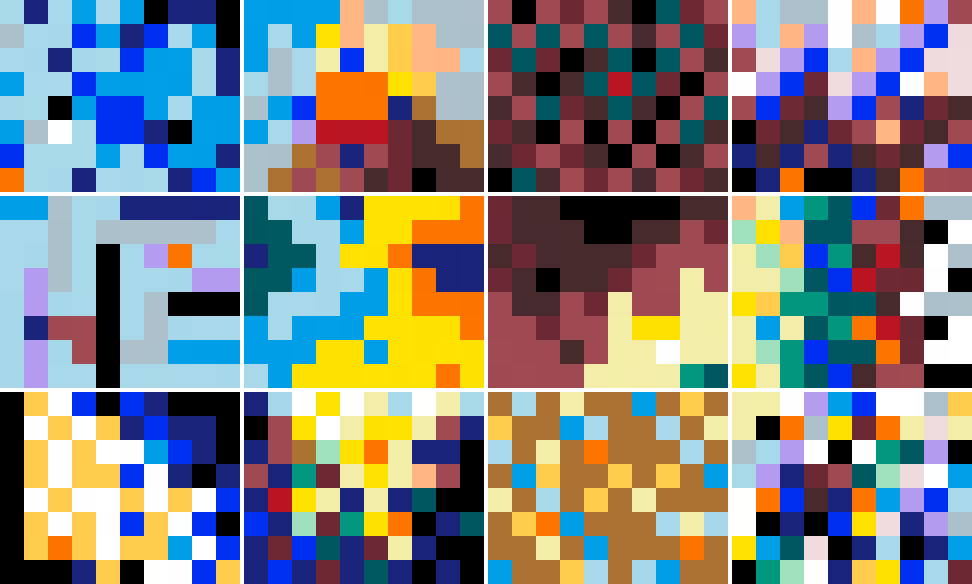

Over four weekends in 1958 and 1959, 40 of the world’s most creative and accomplished architects gathered in Berkeley, California to participate in a psychology study. They assembled at Berkeley’s Institute for Personality Assessment Research (IPAR), which was then at the forefront of the burgeoning field of the psychology of creativity.

At IPAR, the researchers [interviewed each architect, took notes on their social interactions, and administered a battery of personality, intelligence, and creativity assessments][99pi]. One such assessment was the Mosaic Construction Test, created for the study by IPAR members Frank Barron and Wallace Hall.

_Beauty in the Mind of the Beholder_ explores the duality between data (passive sensory input) and code (intentional activity) — or, put differently, between mind and matter. In _Beauty_, a selected subset of mosaics created as part of the IPSR creativity study are used as the parameters of an artificial neural network. Like the panel of art professors who evaluated the mosaics at IPSR, the network is then trained to evaluate images for their aesthetic merits. During training, the colors of the original mosaics shift in subtle ways as the network iteratively adjusts its parameters to improve the quality of its judgments. The resulting mosaics function both as visual artifacts which are subject to human judgment, and as active participants in the process of visual criticism. This process of appropriation brings the midcentury fascination with the newfound science of creativity into dialog with contemporary efforts to quantify aesthetic judgment and creativity using machine learning.

For technical viewers, the similarity of the trained convolutional filters to the original mosaics demonstrates the widely-held assumption that the loss surfaces of deep neural networks have many local optima distributed through the parameter space, and that the closest local optimum to the initial parameter setting can be very close indeed.

While _Beauty_ can be documented in the form of grids of still or moving images, the artwork itself consists of the [parameters][] of the neural network, along with the [code][] necessary to execute it.

<iframe src="https://player.vimeo.com/video/358831025?portrait=0" style="position:absolute;top:0;left:0;width:100%;height:100%;" frameborder="0" allow="autoplay; fullscreen" allowfullscreen></iframe>

 

<figure>
</img>
<figcaption>The original mosaics used to initialize the neural network. From left to right, the mosaics used in this piece are by: (top row) Raphael Soriano, Warren Callister, Louis Kahn, Henry Hill, (middle row) Paul Hayden Kirk, Donn Emmons, Richard Neutra, Victor Lundy, (bottom row) Gardner Dailey, Pietro Belluschi, Worley Wong, and John Johansen.</figcaption>
</figure>

<h3 class="section-header">Acknowledgments</h3>

Thanks to Elizabeth Peele at the [UC Berkeley Institute of Personality and Social Research][IPSR] for providing images of the architects’ mosaics. For more details on the IPSR study, see Pierluigi Serraino's excellent book [The Creative Architect: Inside the Great Midcentury Personality Study][The Creative Architect].

<h3 class="section-header">Technical details</h3>

The network is a variant of the [MobileNet][] architecture, trained for [Neural Image Assessment (NIMA)][NIMA] on the [Aesthetic Visual Analysis (AVA) dataset][AVA], a collection of images from [dpchallenge.com][]. The mosaics are decorrelated using PCA [whitening][] before being injected into the network, and the weights from each step of training are restored for display using the inverse of the transformation matrix derived from the PCA of the original mosaics. The mosaics are used as convolutional filters with an 8x10 kernel in the lowest level of the network.

[99pi]: https://99percentinvisible.org/episode/the-mind-of-an-architect/
[MobileNet]: https://arxiv.org/abs/1704.04861
[NIMA]: https://ai.googleblog.com/2017/12/introducing-nima-neural-image-assessment.html
[AVA]: http://academictorrents.com/details/71631f83b11d3d79d8f84efe0a7e12f0ac001460
[dpchallenge.com]: https://www.dpchallenge.com/ 
[whitening]: https://en.wikipedia.org/wiki/Whitening_transformation
[IPSR]: https://ipsr.berkeley.edu/
[The Creative Architect]: https://www.monacellipress.com/book/the-creative-architect/

[parameters]: ./files/weights_mosaicnet_2019_09_08_23_37_59__01_0.088.hdf5
[code]: https://github.com/justinmanley/image-quality-assessment/tree/mosaics
