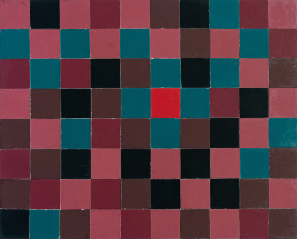
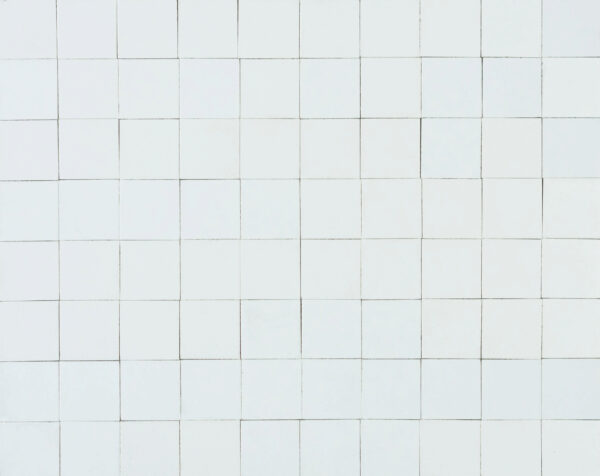

Over four weekends in 1958 and 1959, 40 of the world’s most creative and accomplished architects gathered in Berkeley, California to participate in a psychology study. They assembled at Berkeley’s Institute for Personality Assessment Research (IPAR), which was then at the forefront of the burgeoning field of the psychology of creativity.

At IPAR, the researchers [interviewed each architect, took notes on their social interactions, and administered a battery personality, intelligence, and creativity tests][99pi]. One of the creativity tests was the Mosaic Construction Test, which IPAR members Frank Barron and Wallace Hall had created only a year before.

The Mosaic Construction Test is a test of visual creativity. The test uses a set of colored cardboard squares in a palette of 22 different colors and a rectangular frame accommodating 8x10 squares. Participants are asked to produce a composition which fills the frame completely. The resulting “mosaics” are assessed by a panel of expert judges for originality and artistic merit.

In his book _The Creative Architect: Inside the great midcentury personality study_, Pierluigi Serraino writes that “The Mosaic Construction Test stood out among other evaluative techniques because it entailed the creation of an artistic product...This was their only chance, over their entire assessment weekend, to make a declaration of their own talent.”

<figure>
</img>
<figcaption>Original IPAR mosaic by Louis Kahn. Courtesy of IPSR.</figcaption>
</figure>

<figure>
</img>
<figcaption>Original IPAR mosaic by Eero Saarinen, which he said had, "no meaning other than the pleasure of the texture itself." Courtesy of IPSR.</figcaption>
</figure>

The concept of creativity is itself relatively new. For most of human history, novelty and change were associated with divine forces rather than human actors. This began to shift during the Renaissance in Europe, when artistic innovations became increasingly associated with the individuals who originated them. Giorgio Vasari published _Lives of the Artists_ in 1550, at the height of the Renaissance. This book, which tells the stories of famous painters, sculptors, and architects, exemplifies the developing association between creative products and the people who made them.

The development of creativity unfolded slowly over the centuries following the Renaissance. Francis Galton published _Hereditary Genius_, the first psychometric study of creative accomplishments, in 1868. The first description of a person as ‘creative’ recorded in the Oxford English Dictionary dates to 1875, more than 300 years after Vasari’s Lives. Google n-grams confirms that, as late as 1920, use of the word ‘creativity’ paled in comparison with ‘created’ and ‘creation’ (it is not until 1960 that ‘creativity’ surpassed ‘Creator’). The willingness of forty of the most famous working architects in the country to fly to Berkeley for a weekend of intense scrutiny at IPAR testifies to the widespread acceptance of (and fascination with) the idea of creativity by the middle of the 20th century.

It was around this time that the gradual diffusion of the concept of creativity was sharply altered by a technological development: the invention of the electronic computer. The computer usurped reason and logic, considered since the time of Aristotle uniquely human capacities. Just as the Copernican revolution displaced humanity from the center of the universe, so the invention of the computer seemed to demote the human mind from ‘rational animal’ to ‘meat computer.’ In the ensuing crisis of identity (what anthropologist Sherry Turkle has called the ‘Romantic reaction’ to the computer), creativity was often claimed as a uniquely human attribute which distinguishes humans from computers.

In 1965, electrical engineer A. Michael Noll showed his colleagues at Bell Labs two images. One was a painting by Mondrian. The other was a computer-generated composition intended to match a statistical model of the original Mondrian. Noll found that his colleagues preferred the computer-generated image, and [suggested in the IEEE journal][The Digital Computer as a Creative Medium] that his experiment had implications for the future of creativity. In 2019, Harvard philosopher Sean Dorrance Kelly published a long [article in the MIT Technology Review][Sean Dorrance Kelly] arguing that computational systems will never be creative. These two statements, made more than fifty years apart, demonstrates the enduring importance of creativity and computation in defining what it means to be human.

◊

This series explores the algorithms of human and machine creativity.

Each video shows the process of producing an 8x10 mosaic with 22 colors, following the specifications from the IPAR mosaic test. Although IPAR assessed the mosaics for their creativity in the original study, participants were directed merely to produce images which they found pleasurable. The original instructions read: “Try to make something which, when completed, you can honestly say is something you like.”

The mosaics in this series are optimized to be visually pleasing using a neural network trained for visual aesthetic quality assessment on a dataset of 340,000 Instagram images. Each optimization process is seeded with an original mosaic produced by one of the architects in the IPAR study. The optimization uses a genetic algorithm (mutation only, no recombination). The mosaics are parameterized using a Fourier representation, rather than a pixel-based representation, and the genetic mutations are applied in frequency-space, then mapped back into pixel-space using a Fourier transform.

<figure>

<iframe class="mosaic-video" width="100%" src="https://player.vimeo.com/video/333563547" frameborder="0" allow="autoplay; fullscreen" allowfullscreen></iframe>

<!-- .mosaic-container -->
</figure>

<figure>

<iframe class="mosaic-video" width="100%" src="https://player.vimeo.com/video/333555563" frameborder="0" allow="autoplay; fullscreen" allowfullscreen></iframe>

<!-- .mosaic-container -->
</figure>

[99pi]: https://99percentinvisible.org/episode/the-mind-of-an-architect/
[Sean Dorrance Kelly]: https://www.technologyreview.com/s/612913/a-philosopher-argues-that-an-ai-can-never-be-an-artist/
[The Digital Computer as a Creative Medium]: http://noll.uscannenberg.org/Art%20Papers/Creative%20Medium.pdf
