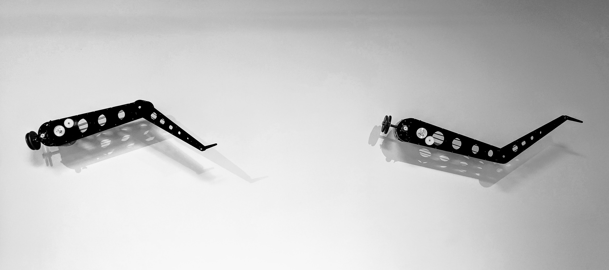

[Again video]: https://www.youtube.com/watch?v=VGeNJs7VLuQ
[“mirror test”]: https://en.wikipedia.org/wiki/Mirror_test
[_Alan Rath: Virtual Unreality_]: https://hosfelt-gallery.square.site/product/alan-rath-virtual-unreality-catalog/7
[San Jose Institute of Contemporary Art]: https://www.icasanjose.org
[Hosfelt Gallery]: http://hosfeltgallery.com
[exhibition]: https://www.icasanjose.org/archive/virtual-unreality

Two robotic arms dance against a white wall. The robots flirt with each other, waving, tickling, stroking, kissing. They are elegant and uncanny: the robots strike a bodybuilder’s pose, flexing, then twirl like octopus tentacles before straightening out into a pair of long human legs. The robotic arms belong to an artwork called _Again_, completed in 2017 by artist Alan Rath, and as I watch their movements, I feel that I am facing a pair of creatures animated by a strange new form of consciousness.

<figure>

<iframe class="youtube-video" width="100%" src="https://www.youtube.com/embed/VGeNJs7VLuQ" frameborder="0" allowfullscreen></iframe>

<!-- .youtube-container -->
</figure>

_Again_ is the latest installment in Rath’s thirty-year engagement with robotic selfhood and otherness. Rath graduated from MIT with a degree in electrical engineering in 1982 and started working in the computer graphics industry near Boston. A few months later, he quit his job and moved to Oakland, California to make electronic art (<a href="https://www.sfgate.com/entertainment/article/Interview-Alan-Rath-3002857.php">electronic parts were cheaper in the Bay Area than anywhere else</a>). Rath began making electronic sculptures in 1984: digital counters, stands of pulsing speakers, and CRT screens showing disembodied hands and lips and eyes. These earliest sculptures play at being creatures in their own right (not merely machines). _Birdcage_ (1985), _Voyeur_ (1986), and _Hound_ (1990) are wonderful examples of this “creaturely” aesthetic. In these sculptures, schematic animal forms and videos of human body parts suggest active awareness. A pair of eyes flicking from side to side and a dog with its nose to the ground are both searching for something. Searching is always an intentional act -- one that is directed towards an object or an outcome in the world. It is the seeming intentionality of these early sculptures that makes them interesting.

Rath’s early work presents the image of an unsociable, single-purpose awareness. Isolation and a relentless outward-facing gaze limit the possibility of sympathetic identification with the machines. A furrowed brow or a falling tear would hint at the motives for the search depicted in these sculptures. _Voyeur_ has neither furrow nor brow, and certainly no tears. Even without such dramatic tics, the eyes might still convey emotion if it were not for the tight crop of the video. Plucked out of the face, these orphaned eyes are missing the facial cues that we normally use to decode emotion. The result is an impression of naked intentionality without thoughts or feelings -- a remarkable feat. 

The roving eyes and sniffing noses of Rath’s early sculptures are entirely outward-focused (that is, they seem always to attend to the current visitor, and nothing else). They have the appeal of surveillance agents: they are interesting to me mainly because they are interested in me. These sculptures might still transcend the emptiness of the one-sided surveillance stare if they had companions to interact with. Watching interactions between creatures which are similar to each other invites us to imagine their experience of each other. But each of these sculptures is an endling, the sole exemplar of its kind. Uniqueness makes each sculpture appear as a freak-show oddity, rather than a peer.

Rath began in the early nineties to explore relationships between pairs of subjects, still within static, one-piece sculptures. His _Vanity_ (1992) shows a man on a CRT screen looking at his own image in a bathroom mirror. The mirror departs from the surveilling stares of Rath’s earlier works by allowing the sculpture’s gaze to turn inward. Like the early video sculptures, this piece considers only a single, narrow aspect of consciousness (in vanity, awareness of the self extinguishes all other modes of awareness). _Couple_ (1992), _Family_ (1994) and _Togetherness II_ (1995) are video sculptures which join multiple subjects in dialog. In these sculptures, screens showing moving lips and contorted faces are bound together by chains and ropes and clamps. Each reads as a single multi-faced, almost schizophrenic object. This is the beginning of a shift from individuals to relationships.

In the years between 1993 and 1998, Rath’s interest in portraying relationships between creatures grew into an obsession. During this period, Rath also began in earnest to make robotic sculptures, artful machines which sense and move autonomously. He designed these machines to interact with each other, and presented them together in ensembles. _Robot Dance_ (1995), _Meet Me At the Corner_ (1998), and _One Track Minds_ (1998) each show two identical figures moving through choreographies of mutual discovery. In _Corner_ and the _Dance_, two long triangular figures are mounted on the wall, where they twirl and stretch. In _One Track Minds_, the pair moves back and forth along a 40-foot track, chasing and embracing. Rath also made larger heterogeneous ensembles during this time, like _Pair_ (1998) and _Friends and Acquaintances_ (1998), in which robots with long unrolling metal tapes and feather-tipped arms probe the cavities and crevices in their counterparts. With these works, Rath finally traces the full outlines of his approach to self and otherness.

<figure>

<iframe class="youtube-video" width="100%" src="https://www.youtube.com/embed/oW2nr9VeEas?start=3023" frameborder="0" allowfullscreen></iframe>

<!-- .youtube-container -->
</figure>

_Robot Dance_ is the progenitor of _Again_, the pair of robotic arms which I saw flirting on the wall at Hosfelt Gallery in 2017. The newer piece has the same overall form and nearly the same choreography as _Robot Dance_. But where _Robot Dance_ is clumsy and jerky, _Again_ is elegant. The newer work far surpasses its original. _Again_ is the pinnacle (thus far) of Rath’s exploration of self, other, and consciousness. Rath doesn’t use these words to describe his work. Instead, he talks about autonomy and sensing -- the language of the roboticist, rather than the philosopher. Yet one cannot appreciate Rath’s robotic sculptures without taking self, other, and consciousness seriously.

<figure>

<iframe class="youtube-video" width="100%" src="https://www.youtube.com/embed/4TLFSUI4kOs?start=1095" frameborder="0" allowfullscreen></iframe>

<!-- .youtube-container -->
</figure>

Two contradictory views of consciousness divide contemporary philosophers of mind. On one account, consciousness is the name we give to our subjective experience of the world — the fact that mere existence feels like anything at all.[1](#subjective-experience) Consciousness is what gives me a self. This view matches the intuition that I am the only person who can vouch for my own experience. At the same time, making consciousness utterly private and incommunicable creates a conundrum. The assumption that others have experience like my own is the foundation of all social life. I make sense of the behavior of others through analogy to myself. It is through this assumption of similarity that empathy, persuasion, and humor are possible at all. Yet, according to the first-person view of consciousness, it is impossible for me to know whether anyone else is conscious. This conclusion is useless at best and paralyzing at worst.

A popular alternative approach holds that a thing is conscious if its behavior is most easily predicted using a vocabulary of thoughts, beliefs, emotions, and intentions. Philosopher Daniel Dennett, who champions this view, calls it the intentional stance.[2](#subjective-experience) This definition is favored by scientists of mind -- psychologists and neuroscientists -- for the way that it makes consciousness observable and measurable. If the first-person theory of consciousness centers on the self, the intentional stance centers on the other. Certainly it resolves the conundrum of the first-person view of consciousness -- the unknowability of other minds. Yet it does so by ignoring that which is most essential to the common-sense understanding of consciousness, namely its origin in personal experience.

The question of consciousness crystallizes the old, persistent tension between subjective and scientific ways of knowing. This is why the debate between the two dominant views of consciousness is a bitter holy war among philosophers, with each side insisting that its theory alone is correct and all others are nonsense. It is clear that each theory of consciousness has serious flaws. Yet I find both to be useful, if one can bear the uncertainty of entertaining two contradictory theories at the same time. An idealistic (or naive) mind can adopt Dennett’s intentional stance and the scientific findings it has encouraged, and still hope to illuminate the private mystery of experience. _Again_ invites just such a hybrid approach through episodes of movement that blur the distinction between self and other.

The best place to view _Again_ is from about fifteen feet back. From there, I have the uncomfortable impression -- it can be described in no other way -- of being in the presence of a pair of mechanical creatures conscious of their environment and of each other. In an awareness that goes beyond that of electronic sensors, these creatures seem to have feelings towards each other: wariness, curiosity, anticipation. There is something embarrassing in the persistence of _Again_’s anthropomorphic fantasy — perhaps its scientific implausibility (we are far from understanding consciousness, let alone creating it), or its seeming regression to illusionism as the standard of art. This is an old artist’s trick: take a forgotten everyday phenomenon and relocate it to a new context in order to stir fresh appreciation. In facing _Again_, we become newly aware of the intentional stance and of how little we are able to explain or justify its application.

_Again_ conveys the impression of consciousness through a novel vocabulary of abstract gestures. Designed for the infinitely-rotatable jointed arms of _Again_, this vocabulary produces a dance no human could perform. The movements generate the meaning of this work.

Each gesture in _Again_ evokes a different animal form: a human leg; an octopus tentacle; the beak of a long-necked bird; a human arm curling and flexing. The familiarity of these forms creates a sense of life within each brief episode of movement. The transitions between episodes are grotesque; the human leg contorts and twirls unnaturally to become an arm, which twists against itself, snakelike, to become something else entirely. These juxtapositions discourage attachment to any particular biological metaphor. Instead, the montage focuses attention on the commonalities shared among organisms. The result is a novel synthetic whole, a lifelike machine which is unlike any particular animal.

<figure>

<iframe class="youtube-video" width="100%" src="https://www.youtube.com/embed/VTNmLt7QX8E" frameborder="0" allowfullscreen></iframe>

<!-- .youtube-container -->
</figure>

It is important that the figures in _Again_ are embodied. In one early study of anthropomorphism, psychologists Fritz Heider & Marianne Simmel showed subjects an animation of abstract geometric shapes. Subjects narrated the animation by giving the abstract shapes emotions and intentions. I see intentionality in both the animation in the study and in _Again_. Yet I am sharply aware that the shapes in Heider & Simmel’s animation are merely representations of consciousness, not the real thing. My awareness of this artifice limits the emotional scope of the encounter between Heider & Simmel’s shapes. The embodiment of the figures in _Again_ collapses the distance between the representation and reality of intentionality. The arms move in a plane, but have enough depth to deny the flatness of the moving image. As a result, _Again_ feels authentic in a way that mere animations do not. This is key to the emotive power of the sculpture (and the main reason that videos of Rath’s robots are always less impressive than the real thing).

A single gesture in _Again_ -- a twirl, a wave -- is enough to suggest life. The impression of consciousness, on the other hand, comes from the relationship between the two figures. Consciousness in humans is not static -- it develops, and it does so in a social context. Newborn babies can mimic the facial expressions of adults within hours of birth,[3](#mimicking-facial-expressions) but it takes four years for children to develop a full awareness of self and other.[4](#full-awareness) It is in babies that we see consciousness at its simplest, unencumbered by sophisticated language or culture. At this early, pre-linguistic stage, infants develop their awareness of self and other through gestural exchanges: pointing, mirroring, sharing attention with adults. These same patterns of interaction structure the choreography of _Again_.

As the robotic figures move, they often mirror each other’s motions. Some reflections are simple, as when the figures mirror each other across the vertical line midway between them or over the horizontal line that connects their bases. Others are more subtle: often, the axis of reflection runs through the largest arm segment and rotates along with it. Occasionally, the two figures are related by a point reflection. Most symmetries of shapes on a flat surface can be realized by sliding the shapes around until they overlap. Reflections are different. To demonstrate a reflection, one must lift up the object and flip it over. This additional step challenges the mind’s eye[5](#cognitive-labor-symmetry). It is easy to recognize the similarity of the two figures in _Again_, but it takes work to reconcile them. The mirror symmetries in _Again_ are tantalizing; they mark the similarity and the irreconcilable difference between the two identical figures. It is impossible to tell which movements come first — which figure is “real” and which is merely the mirror image.

<figure>

<iframe class="youtube-video" width="100%" src="https://www.youtube.com/embed/TRSXpdsEWwQ" frameborder="0" allowfullscreen></iframe>

<!-- .youtube-container -->
<figcaption>Rath's _Vanity_ (1992) shows a face confronting itself in the mirror.</figcaption>
</figure>

A famous series of experiments in psychology explore the way that animals respond to their mirror images. In these experiments, researchers secretly mark the subject’s forehead with a patch of color, then observe whether subjects touch the mark on their forehead when they see it in the mirror. Many psychologists treat this [“mirror test”][] as an indicator of self-awareness. Human babies typically pass the mirror test at eighteen months. Dolphins, magpies, chimpanzees, and other great apes have also passed the mirror test. Most animals fail, either ignoring their mirror image, or treating it as another member of their own species. The mirror  plumbs its user for the ability to distinguish between self, other, and mere representation. Episodes of symmetric movement in _Again_ evoke the mirror test. Yet the figures in _Again_ move smoothly between encounters of self with self (mirror), and self with other (dialog). These transitions blur the boundaries between the two, depicting a self and other which are thoroughly entangled. In picturing a continuum between self and other, _Again_ suggests that the opposing theories of consciousness which center on self and other might also meet somewhere in the middle.

The figures in _Again_ seem most individual and most aware of each other when their gestures become conversational. In one such sequence, they reach out towards each other, almost fully extended. From this position, they take turns to wave at each other, waggling their smallest segments. After exchanging gestures, they swivel to a new position, and repeat. In another sequence, one of the arms hangs motionless, crooked in a sideways “v”. The other arm extends to point and wave, and they switch places and repeat. This dance of alternating movement and stillness has the logic of dialog. The figures seem to respond to each other, pausing as if to listen or observe. Although they have no discernable means of sensing the world, they point at each other with a delicate accuracy that suggests awareness.

A key milestone in the development of infant consciousness occurs around nine months after birth. The infant at this age begins to follow the gaze of another and to direct the other’s attention by pointing at objects of interest.[6](#pointing) One early study of the phenomenon seats an infant and an adult across from each other, then has the adult turn and point to the side with a theatrical “Oh, look!”[7](#joint-attention-study) The researchers observe when and how the infant follows the adult’s gaze.[8](#following-gaze) Some psychologists consider this joint attention sharing to be the child’s first demonstration of an awareness of the other as an intentional being like the self.[9](#joint-attention) _Again_ has a single outward-pointing gesture (the only gesture that was not present in the original _Robot Dance_). In this move, both figures point crookedly in the same horizontal direction and wave gently. This action is the dancerly expression of joint attention sharing.

<figure>
</img>
</figure>

Many of the motifs in _Again_ are present in Rath’s earliest two-part robotic sculptures: _Robot Dance_, _Meet Me at the Corner_, and _One Track Minds_. It is in the spare forms and bipartite compositions of these works that Rath first identifies a formal language adequate to the exploration of the relationship between self and other. In these works, as in _Again_, there is so little to see that every gesture acquires unmerited significance. The extreme simplicity of these pieces allows them to transcend the details of any particular self and other to depict the ideas in the abstract. The larger and more varied ensembles, like _Friends and Acquaintances_, _Pair_, and _Five on a Wall_ fail to achieve the same presence -- although they do elicit a certain prurient fascination. Though the repertoire of movements is simple, the machines themselves are a wild menagerie of colors, textures, and forms, different in almost every way from each other. The interplay of commonality and difference that constitutes the presence of self and other is subsumed under a welter of visual details.

Two questions remain: If _Robot Dance_ contains the essential elements of the later work, why did Rath bother with _Again_ at all? And why should we? Perhaps because _Again_ visibly improves on _Robot Dance_ in many small ways. The black plywood armature focuses attention on the choreography by heightening the contrast with the wall and by concealing the electronics. The movements themselves are smoother and more expressive. In _Robot Dance_, each figure moves segment-by-segment; in _Again_, the entire arm moves at once in a single fluid motion. The smallest segment, limited to 120 degrees of rotation in _Robot Dance_, is free to spin full circle in _Again_, which it does with a spirit of gleeful abandon. Yet these details alone don’t seem to justify _Again_, nor do they explain why Rath returned to _Robot Dance_ after twenty years of exploring other forms. 

The answer to these questions is hidden in the story of _Again_’s electronics. All of the electrical components in _Again_ are custom-made. This custom hardware by its design makes the themes of the choreography an integral part of the sculpture. It was only in 2015, when Rath began working on _Again_, that it was possible for him to give _Again_ this deep thematic consistency. But the story of _Again_’s electronics begins much earlier.

The idea for a machine with dancing arms first occurred to Rath in childhood. _Robot Dance_ was the first realization of that idea, and it is best understood as a sketch, a prototype that was ahead of its time. Rath built _Robot Dance_ as soon as he could buy a computer powerful enough to calculate its trajectories. _Robot Dance_ was clumsy, but it acted as a signpost: it showed Rath what he had to learn in order to fully realize his idea. Over the next twenty years, Rath developed the skills, tools, and electrical components demanded by his vision of a graceful, self-sufficient _Robot Dance_. _Meet Me at the Corner_ features Rath’s first custom-built belt-and-pulley system. Immediately afterwards, Rath bought a mill and a lathe, machine tools more powerful than his earlier drill press. For the solitary feathered sculptures that Rath started making in the 2000s, he developed custom motor controllers, powerful and light, each with a built-in microcontroller for planning movement and communicating over the network. _Again_ combines all of these inventions. _Again_ is built entirely from Rath’s own custom-made components. The custom components smooth the movements, a small change that makes a big difference in the quality of the anthropomorphic illusion. Each electronic component in _Again_ has just the strength it needs, and no more. The components were designed for each other, and they fit together perfectly to create a irreducible whole. Where _Robot Dance_ had to be clumsily assembled piece-by-piece for each installation, _Again_ is self-contained. In this way, the hardware reflects the same tension between interdependence and autonomy that characterizes the choreography. 

I said the best place to view _Again_ is from fifteen feet back. It is possible also to come close to _Again_ and to stand so that the pulley belts and red electrical wires inside the arm are visible. At this distance, consciousness disappears, and the work appears entirely mechanical. It is easy to resume the illusion of consciousness (just step backwards), but impossible to hold both impressions in mind at the same time. This experience of walking around _Again_ demonstrates how personal is the judgment of an other’s consciousness. Originating as it does in subjective, first-person experience, it is possible that consciousness will always be fundamentally beyond the reach of science. Yet it is clear that we need a science of consciousness. Left alone, our judgments of consciousness are too much guided by convenience: we anthropomorphize our pets and convince ourselves of the mindlessness of the cows and chicken whose flesh fills our plates. A complete philosophy of consciousness must embrace both the scientific and the subjective. Until such a philosophy is devised, _Again_ will serve as a rare reminder of the way that these two modes of knowing are tangled in the experience of self and other.

-----------

Thanks to Abigail Kelly, Amantia Muhedini, and Mike Webb for commenting on drafts of this essay.

This essay originally appeared in the catalog [_Alan Rath: Virtual Unreality_][], published by the [San Jose Institute of Contemporary Art][] and [Hosfelt Gallery][] on the occasion of the retrospective [exhibition][] of the same name.

##### Notes

<a name="subjective-experience">1.</a> Philosophers Thomas Nagel and John Searle exemplify this tradition in the philosophy of mind. See Nagel, “What is it like to be a bat?” and Searle, “Reductionism and the Irreducibility of Consciousness” in _Emergence: Contemporary Readings in Philosophy and Science_, ed. Mark A. Bedau and Paul Humphreys (2008). 

<a name="dennett">2.</a> Dennett, _The Intentional Stance_ (1987) and _Consciousness Explained_ (1991). For a wonderful overview of Dennett’s approach to consciousness, see the short essay “Real Patterns,” in _Emergence: Contemporary Readings in Philosophy and Science_, ed. Mark A. Bedau and Paul Humphreys (2008).

<a name="mimicking-facial-expressions">3.</a> The original publication is "Newborn Infants Imitate Adult Facial Gestures," by Meltzoff & Moore (1983). See “The role of imitation in understanding persons and developing a theory of mind,” by Meltzoff & Gopnik (1993) for an overview of the confirming studies which followed this initial experiment.

<a name="full-awareness">4.</a> Tomasello, _The Cultural Origins of Human Cognition_ (1999), p. 174.

<a name="cognitive-labor-symmetry">5.</a> For an interesting discussion of studies in the mental labor of observing symmetries, see Daniel Dennett, “Towards a Cognitive Theory of Consciousness”, pp. 219 - 221.

<a name="pointing">6.</a> Tomasello, “Joint Attention as Social Cognition” in _Joint Attention: Its Origin and Role in Development_, ed. Chris Moore and Philip J. Dunham (2016), pp. 103 - 105. 

<a name="joint-attention-study">7.</a> Jerome Bruner. “From Joint Attention to the Meeting of Minds: An Introduction” in _Joint Attention: Its Origin and Role in Development_, ed. Chris Moore and Philip J. Dunham (2016), p. 7.

<a name="following-gaze">8.</a> Scaife, Michael and Jerome Bruner. “The capacity for joint visual attention in the infant,” 
Nature, volume 253, pp. 265–266 (24 January 1975).

<a name="joint-attention">9.</a> Tomasello, _The Cultural Origins of Human Cognition_, pp. 62 - 70.

