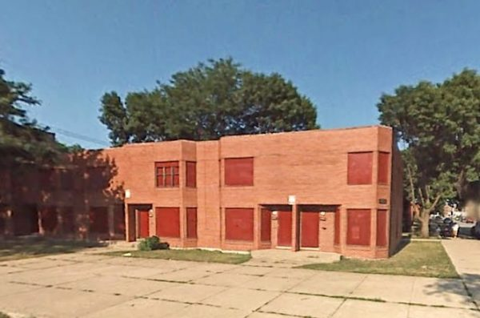
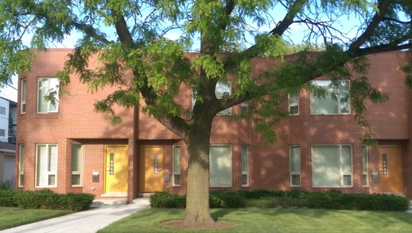
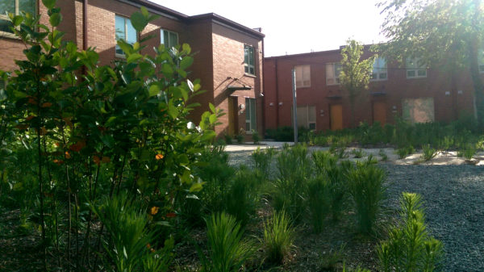

[Chiraq]:                                   https://www.youtube.com/watch?v=R9HuKssWhrU
[Stony Island Arts Bank]:                   https://rebuild-foundation.org/site/stony-island-arts-bank/
[Dezeen on Arts Bank]:                      http://www.dezeen.com/2015/10/03/theaster-gates-transforms-abandoned-chicago-bank-public-arts-centre/
[Dorchester Art + Housing Collaborative]:   http://dorchesterarthousing.com/
[Rebuild Foundation]:                       https://rebuild-foundation.org/
[Brinshore Development]:                    http://brinshore.com/
[Landon Bone Baker Architects]:             http://landonbonebaker.com/
[Chicago Tribune poverty statistics]:       http://crime.chicagotribune.com/chicago/community/greater-grand-crossing#note-3
[site design group]:                        http://www.site-design.com/
[CHA 2014 annual report]:                   http://www.thecha.org/file.aspx?DocumentId=1419
[WPAI announcement]:                        http://arts.uchicago.edu/article/arts-and-public-life-initiative-unveils-arts-incubator-washington-park
[Washington Park Arts Incubator]:           http://arts.uchicago.edu/artsandpubliclife/ai 
[Alexandria Eregbu]:                        http://www.alexandriaeregbu.com/
[Caroline Kent]:                            http://www.carolinekent.com
[Eliza Myrie]:                              http://www.elizabmyrie.com/
[Black Artists Retreat]:                    http://blackartistsretreat.com/
[B.A.R. article]:                           http://theastergates.com/section/382198_B_A_R_Black_Artists_Retreat.html
[Carlos Bunga tweets]:                      https://twitter.com/outoftheyards/status/653244188155187200
[Carlos Bunga]:                             http://www.cgrimes.com/artists/carlos-bunga/offsite_exhibitions/
[Teleological Study with Hose]:             http://theastergates.com/artwork/2819882_Teleological_Study_with_Hose.html
[Ain't I a Man]:                            http://theastergates.com/artwork/2819859_Ain_t_I_a_Man.html

While Spike Lee’s [Chiraq][] plays in theaters, Theaster is playing out a different vision of life on Chicago’s South Side, driven by Black culture instead of ‘black-on-black’ violence, and animated by art, rather than guns. 

Chicago artist Theaster Gates bought an abandoned bank building for just $1 from the City of Chicago in 2013. Since then, his fans have eagerly awaited the debut of the [Stony Island Arts Bank][], an exhibition space and archive which opened in October to much fanfare. Though it’s an impressive demonstration of Gates’ fundraising chops (it cost $3.5M to make the building structurally sound), the building is architecturally underwhelming at present. Except for the lavish library at the back of the building, the Arts Bank is little more than an empty shell. 

While [design blogs][Dezeen on Arts Bank] and Instagrammers slaver over the empty Arts Bank, an important project just two blocks South has gone largely unnoticed. This project, a renovated mixed-income housing development called [Dorchester Art + Housing Collaborative][] (DA+HC), deserves attention. Gates and his nonprofit [Rebuild Foundation][] partnered with [Brinshore Development][] and architects [Landon Bone Baker Architects][] (LBBA) to create DA+HC, and the playful, generous redesign by LBBA makes it a star example of mixed-income housing redevelopment in Chicago. DA+HC is an important step in Gates’ overarching project to turn Greater Grand Crossing into a cultural hub.

<figure>
</img>
<figcaption>Buildings owned by Gates or hosting Rebuild's programs are marked in blue on this map. The map shows the corner of Greater Grand Crossing where Gates has focused his attention.</figcaption>
</figure>

Once a bustling working-class neighborhood, Greater Grand Crossing was hollowed out in the 1960s and 1970s by white flight, and never fully recovered. The neighborhood today is poor ([25% of residents are below the poverty line][Chicago Tribune poverty statistics]) and sparsely populated. Brick walk-up apartment buildings and single-family homes front on Greater Grand Crossing’s quiet one-way streets. On a closer look, many of these buildings are neatly boarded up with weathered plywood. There are vacant lots on every block - not the trash-littered and graffittied asphalt lots of the proverbial “inner city”, but green plots taken over by grass. It’s a neighborhood that has seen hard times.

<figure>
</img>
<figcaption>DA+HC was closed down and boarded up in 2007. Image © 2015 Google.</figcaption>
</figure>

Gates has sought to transform the neighborhood since he arrived in 2006. He recalled in a 2014 interview: “You know my block is a violent block...When I moved there, people didn’t want to visit...I was really determined for Sixty-Ninth and Dorchester to be the most important place in the city...There’s still extreme violence, and yet beautiful things should happen in black space, because violent things happen everywhere. Right?”

DA+HC sits on 70th Street between Dante and Harper Avenues in the middle of this community, across from an elementary school, a playground, and one of those verdant vacant lots. The housing complex was originally designed by the Chicago Housing Authority (CHA) in the late 1970s, and opened in 1981 with 36 units of public housing in seven two-story brick buildings.

<figure>
</img>
<figcaption>This birds-eye rendering of Dante-Harper Townhomes was featured in a 1981 issue of the Chicago Housing Authority Times.<figcaption>
</figure>

The buildings are arranged along the sidewalk to create semi-enclosed common spaces at the back, away from the street. These shared, sheltered outdoor spaces help foster a sense of community by providing a space for residents to gather. On the larger block, between Dante and Harper Avenues, the sheltered interior of the block is subtly divided into two smaller spaces by a building that is set back from the sidewalk. With ten (originally twelve) units opening onto each of these smaller spaces, this division creates outdoor spaces which are more sheltered and intimate, but still provide opportunities for community interactions.

The gaps between the buildings serve as passages which visually and acoustically link the sidewalk to the gardens in back, helping to integrate the residents into the social fabric of the neighborhood.

Simple variations in the plan of the CHA townhouses make the spare, undecorated facades attractive. The facades step gently to and from the sidewalk, creating elongated bays and shallow recesses to shelter the front doors. This articulation of the facade serves as a kind of economical decoration for the building, creating patterns of light and shadow and giving each unit a sense of individuality. The materials matter, too. The red bricks used to cover the facades of the townhouses are standard-size fired clay bricks, not the larger concrete bricks often used by the 1980s to cut labor costs. These construction details help the CHA units to blend pleasantly with the older brick apartment buildings and single-family houses on the neighboring blocks.

<figure>
</img>
<figcaption>The beveled corners, entryway niches, and modulations in the plan of the facade lend visual appeal to the spare brick wall.</figcaption>
</figure>

The Dante-Harper Townhomes reflect the complex and sometimes contradictory history of the CHA with respect to race, poverty, and housing in Chicago. The townhomes were built by the CHA as a result of a court order following the 1969 housing desegregation case Gautreaux v. Chicago Housing Authority. Gautreaux required the CHA to increase its stock of low-income units; to build or acquire public housing in white areas of the city before further development in racial minority areas; and to ensure that 50% of residents in each new development were drawn from the local community. Dante-Harper Townhomes failed in at least one respect: by the time it opened in 1981, the neighborhood was 70% - 90% black (hardly the integration required by Gautreaux!), and the CHA was building less housing, not more, than before. Despite this, the buildings avoid the banal, “poverty-oriented look” criticized by housing historian J. S. Fuerst. Perhaps inspired by developments commissioned by the CHA during the 1950s and 1960s, the Dante-Harper Townhomes was well-designed to invest the lives of its residents with dignity and foster a sense of community.

The Rebuild partnership made a number of important changes to the townhome development which further improve it. First, the central four-units between Dante and Harper were demolished to create an art center. Rebuild Foundation determined from a neighborhood survey that there was a need for performance space in Greater Grand Crossing. In response to this need, the art center at DA+HC houses a purpose-built dance studio and a craft space. Both will be open to residents of the neighborhood and to the arts elementary school across the street. 

The dance studio is a beautiful space, with a high ceiling, spring-loaded wood floor for dancing, and lots of light. The front and back walls are all glass, save a vintage sliding door in front, and the resulting visual connection between the front and back of DA+HC helps link the semi-private spaces behind DA+HC to the public life of the neighborhood.

The landscaping created by [site design group][] in collaboration with LBBA, is another significant addition to the development. In the original design, the sidewalk at 70th and Dante stretches twenty feet from the curb to the front doors of the townhomes. In the redevelopment, the expanses of concrete are replaced by generous front yards.

In the back, LBBA has replaced the grass backyards of the original design, which opened directly onto the alley, with two rock gardens containing seating and landscaped with shrubs and young birch trees. The architects also introduced a fence and a sidewalk along the back of this yard, heightening the sense of enclosure by dividing it from the alley. The parking spaces along the alley are surfaced using concrete brick pavers, rather than asphalt, which, from the rock gardens, creates the impression of a terrace that extends beyond the sidewalk. 

<figure>
</img>
<figcaption>The rear of DA+HC encloses a rock garden planted with low shrubs and young birch trees.</figcaption>
</figure>

Finally, some small details - mustard yellow doors and a crimson band at the roofline - provide a playful touch. In short, the interventions of the Rebuild / LBBA / Brinshore partnership complement the existing strengths of the building and strengthen the possibilities for community formation by improving the shared spaces.

Residents of Greater Grand Crossing and critics alike have wondered whether Gates’ ascendant practice will gentrify the neighborhood in which it is anchored. Historically, artists have often been in the vanguard of displacement in neighborhood change - in the words of art historian Rosalynd Deutsche, artists are “the ‘shock troops’ of gentrification.”

The twelve CHA units at DA+HC do increase the neighborhood’s stock of affordable housing - but when compared with the [358 units CHA delivered in 2014][CHA 2014 annual report], it’s clear that they are a drop in the bucket. DA+HC is, at best, a gesture towards affordability. The reality of Greater Grand Crossing, according to Gates, is that gentrification still seems an unlikely and distant danger to most people on the block. Gates says: “People wanna leave if they can, and people have a right to leave. It becomes tricky...am I trying to trick people into staying? What can I offer?”

Perhaps the best way to understand the strategic position of DA+HC in Gates’ practice is as an incubator - a word that Gates himself has used elsewhere. Gates has long been interested in building communities of Black artists. In 2013, Gates [opened][WPAI announcement] the University of Chicago’s [Washington Park Arts Incubator][] (WPAI), two and a half miles northwest of DA+HC. In the two years since it opened, WPAI has organized gallery shows by [Alexandria Eregbu][], [Caroline Kent][], and other Chicago artists, run training programs for local high-schoolers, and hosted community events. In 2013, Gates and artist [Eliza Myrie][] hosted the first [Black Artists Retreat][] (B.A.R.), which [brought dozens of Black artists together][B.A.R. article] at Dorchester Projects for two days of conversation and collaborative work.

At the Arts Bank, Gates has collected a vast (though uncatalogued) archive of Black history, literature, and media. Rebuild has a rotating artist residency program which brings artists to the neighborhood for a few weeks. Each resident artist is asked to use Rebuild’s collections at the Arts Bank in the work they produce during the residency.

<figure>
</img>
<figcaption>Looking down into the atrium of the Stony Island Arts Bank. The pillars around the atrium are a temporary installation by artist Carlos Bunga. Photo by Steven Vance.</figcaption>
</figure>

Unlike B.A.R. or the resident artists hosted by Rebuild Foundation, DA+HC is a sustained intervention which can be a source of stability and longevity for the artistic ecosystem in Greater Grand Crossing. Hopeful residents must apply to a panel of community members, and artists are given priority. Rebuild Program Manager Demecina Beehn says that DA+HC currently houses eight artists and curators, including a ceramicist, a filmmaker, and a makeup artist. In this way, DA+HC will bring artists who have a long-term involvement with the community - and, Gates is betting - with Rebuild’s collections. The [best piece][Carlos Bunga tweets] at the debut of the Arts Bank was not an artwork by Gates, but a monumental installation in cardboard by Portuguese artist [Carlos Bunga][]. Similarly, in years to come, Gates’ most important work may come to be not his framed [fire hoses][Teleological Study with Hose] or [tar paintings][Ain't I a Man], but the artistic activity he fomented on the South Side of Chicago.

