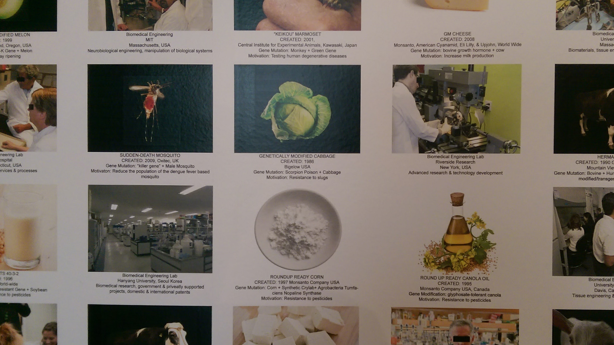
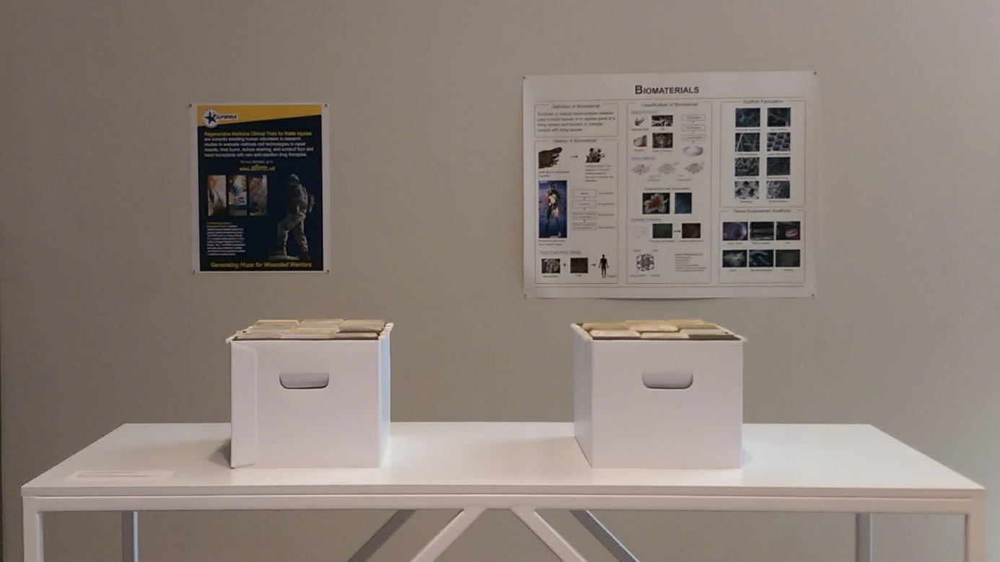

[Roberta Breitmore Construction Chart]: http://www.bitforms.com/leeson/roberta-construction-chart-2
[Safety Considerations for Biotechnology]: http://www.oecd.org/science/biotrack/1958527.pdf
[Coordinated Framework for Regulation of Biotechnology]: https://www.aphis.usda.gov/brs/fedregister/coordinated_framework.pdf
[The Creation of Adam]: https://en.wikipedia.org/wiki/The_Creation_of_Adam 

In _The Infinity Engine_ (2014 - 2017), artist Lynn Hershman Leeson offers a concentrated experience of the contemporary debate over the implications of genetic modification and other emerging biotechnologies. The multimedia installation traces the movement of these technologies through society from inception in the laboratory to eventual acceptance into living human bodies. For me, a layperson, the _The Infinity Engine_ awakens a disheartening awareness of the uncertainty of our biological future and my own lack of agency.

Visitors enter _The Infinity Engine_ through a two-channel video installation depicting a bioengineering laboratory. The video evokes in me a complex and contradictory emotional response: curiosity and frustration, suspicion and guilt. One channel shows a drab, dimly lit hallway blocked at the end by a pair of closed doors. Over the slow course of several minutes, the camera approaches the end of the hallway, rebounds, and retreats backwards, always keeping the closed doors in view. The long sojourn in the empty hallway, combined with the tantalizing glimpses beyond the door are a cinematic shell game, an obvious ploy that nonetheless makes me feel both curious and excluded.

Next to the projection of the empty hallway, a second video channel shows the laboratory itself, a cluttered maze populated by scientists in white lab coats. Admittance to the inner sanctum piques my curiosity, but also, paradoxically, makes me feel more excluded. The camera, held at waist level, makes me feel like a child lost in the laboratory. The space is full of machines that look like sophisticated dishwashers and refrigerators and boilers as well as inscrutable countertop appliances that tremble and twirl. A dramatic close-up of a fleshy triangular object — a bioengineered nose — reveals the ultimate product of the scientists’ efforts. The purposeful movements suggest a complex coordination that is hidden from view. Yet we are ostentatiously excluded from understanding the way that the activities of the scientists converge to produce this miracle. The video is silent, and the faces of the scientists are rendered unreadable by deep shadows added in post-production. 

I can hardly disclose my foiled curiosity without also mentioning the dreadful suspense I feel as I watch the video. The inescapable gloom of the long hallway, the blue-green tint of the laboratory, and the faceless people in white robes all contribute to this sense of foreboding. It is a mark of our times (or perhaps merely of my acculturation into the enthusiastic technoculture of the Bay Area) that I feel guilty at my unease. I feel that I am doubting the beneficence of science, assenting to a nebulous anti-scientific skepticism. And how different, I wonder, is this skepticism from the much-ridiculed skepticism of the anti-vaccer or creationist?

Passing through the video installation into the main room of _The Infinity Engine_, I’m surprised at the persistence with which the installation is grounded in the ethical uncertainties and constraints of the present. Hershman Leeson muses in an interview about _The Infinity Engine_, “you have have designer babies...and in a sense that’s’ biological censorship...there’s one company that can erase part of your memory...if they can erase memories, maybe they can put in memories.” Yet in the installation itself, she eschews the vivid dystopias of _Brave New World_ and the more recent _Black Mirror_. Instead, _The Infinity Engine_ juxtaposes the concrete benefits already afforded by emerging biotechnologies with contemporary struggles over access, control, and ownership.

<figure>
</img>
<figcaption>The wallpaper in the installation displays a seemingly _infinite_ array of recent biotechnological discoveries and inventions. These advances are juxtaposed against images of their laboratory origins.</figcaption>
</figure>

The emotional intensity of _The Infinity Engine_ comes from the sincerity of Hershman Leeson’s engagement with scientists and cynics alike, as well as her characteristic use of irony. The iconic wallpaper catalogs bioengineered crops and farm animals, each captioned with the motivation for their development: “Increase milk production” — “Reduce the population of the dengue fever based mosquito” — “Resistance to slugs.” Interviews with biologist Elizabeth Blackburn show the Nobel laureate still shining with quiet excitement as she relates the details of her 1984 co-discovery of telomerase. I was genuinely inspired by a promotional video for regenerative medicine, produced by Hershman Leeson, in which Luke Masala, a healthy 19 year-old boy mowing the lawn shirtless in the summer heat, reveals that he was given an artificial bladder grown from his own cells when he was 9 years old. Elsewhere, in reports from the OECD, FDA and WHO with titles like “[Safety Considerations for Biotechnology][]” and “[Coordinated Framework for Regulation of Biotechnology][],” and in interviews with sociologist Troy Duster and artist Oron Catts, the installation gives voice to earnest criticisms and proposed solutions for the problems of biotechnology.

Yet always, the struggle to harness the potential of biotechnology is dominated by experts: scientists and engineers, economists and judges, all of whose activity is made to seem incomprehensible. In the video of the laboratory, the scientists’ movements are emptied of meaning by silence, fragmentation, and by careful framing that keeps the material transformations of chemicals into living tissue hidden just out of sight. In the next room a tongue-in-cheek invitation — “Visitors are welcome to read through the patent infringement cases” — belies the overwhelming prospect of hundreds of pages of patent filings, Supreme Court opinions, and technical reports, labeled clearly, but unordered and without any explanation. The only amateur response to biotechnology modeled by the installation is Luke Masala’s uncritical “woooow!” Likewise, the aestheticized 3D-printed ear and tank of genetically modified fish offer visitors an opportunity to practice passive, uncomprehending amazement, but little else.

<figure>
</img>
<figcaption>Two boxes hold hundreds of pages of technical reports, patents filings, Supreme Court opinions, and policy recommendations related to biotechnology.</figcaption>
</figure>

Irony and sincerity jostle against each other in _The Infinity Engine_. Hershman Leeson has long used irony in her work. In her 1975 _[Roberta Breitmore Construction Chart][]_, Hershman Leeson annotates a photographic portrait of her eponymous alter-ego with “suggested alterations”: “reshape lips” and “add: false eyelashes.” The satisfying bite of the _Construction Chart_ comes from the sharp contradiction between the cosmetic instructions and their intended interpretation. In _The Infinity Engine_, a science fair poster situates contemporary “biomaterials” in a historical lineage of medical intervention beginning with ancient Egyptian wooden prosthetics — earnestly illustrated with a grotesque photograph of a desiccated, mummified foot. Another poster advertising an experimental regenerative medicine program for ‘Wounded Warriors’ leaves untouched the senseless violence of war itself. By far the most dramatic ironic gesture is the floor-to-ceiling riff on _[The Creation of Adam][]_, reinterpreted for the laboratory with gloved hands and syringes. This brazen, kitschy image touches at once the opposition of religious groups to genetic modification, the hubris of scientists — and, more subtly, suggests that, left alone, scientists will create the future in their own image.

I leave _The Infinity Engine_ the way I came, past the eerie video installation. On my way out, I catch sight of myself in the floor-to-ceiling mirrors opposite the projection, where it looks like I, too, am walking purposefully through the laboratory. Feeling uncertain and helpless, I wonder again where I fit into the laboratory and its bioengineered future. Perhaps the resignation of _The Infinity Engine_ would be a comfortable relief. Yet somehow, against this “laugh that leaves one with no breath at all,”[1](#sontag) I am determined to cling to the possibility of ethical action in the face of scientific progress.

-----------
  
<a name="sontag">1: </a> Sontag, Susan. "The Aesthetics of Solitude" in _Studies of Radical Will_. New York: Farrar, Straus and Giroux, 1969.
