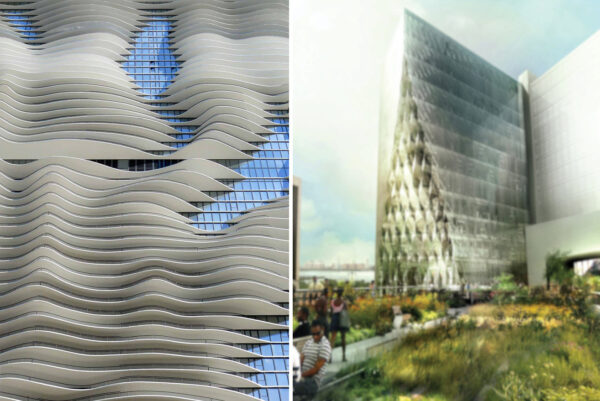
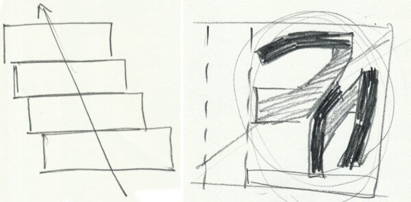

Chicago-based architecture firm [Studio Gang][] last month unveiled renderings for its latest project, a [new dormitory at the University of Chicago][announcement].  The design is smart and thoughtful, responsive to both the needs of the students who will live within and the local context of the University and Hyde Park neighborhood.

Studio Gang has produced significant theoretical and built works since its founding in 1997 by Principal Jeanne Gang.  Gang’s keen understanding of the structural and aesthetic potential of materials is evidenced in Aqua Tower, in the Arcus Center for Kalamazoo College, and her Nature Boardwalk at the Lincoln Park Zoo.  In addition, the firm is known for its sensitivity to the cultural and historical context of its projects, as in Hyderabad 02 and the Solar Carve Tower in New York City, currently under construction.

<figure>
</img>
<figcaption>Left: the undulating balconies of Studio Gang's Aqua Tower, located in downtown Chicago, reveal Gang's sensitivity to the structural and aesthetic capabilities of concrete. Right: Studio Gang's Solar Carve Tower, located in New York City, responds to the High Line directly below, stepping back to allow light to reach the popular linear park.</figcaption>
</figure>

Gang’s latest design features three tall buildings – five, eleven, and fifteen stories tall – with public and semi-public spaces on the ground floor and dormitory rooms and student common spaces above.  The buildings are situated within a mixture of public and private park spaces that Gang has envisioned as an extension of the green spaces of the existing campus.

Housing at the University of Chicago is organized into a residential house system in which students live in houses of 40 to 100 students. These residential houses are meant to be the focus of social and academic life for students living on campus.  Gang’s design translates this social organization into architectural form by imagining the core of each house as a literal three-story house.

The three-story module derived from the suburban house becomes the social nucleus of each residential house in Gang’s design.  Each finished building – a complex of houses – results from a series of spatial operations on this nucleus.  First, dormitory rooms are added to both sides of this nucleus, extending the house into a long horizontal block through a process of accretion.  The buildings then rise up from the ground as an (almost) vertical stack of blocks.

The distinction made between these blocks (and thus the houses they contain) using the stacking operation is important.  For students living in these dormitories, each house has a unique character formed by its residents and their shared experiences.  These differences between the houses are important because they provide students with a sense of belonging and group identity that is a main aim of the house system.  In Gang’s design, houses are stacked with a slight horizontal offset, rather than straight up.  This offset of each House from its neighbors above and below embodies the differences between Houses and their relationship to each other within the House system.

Other contemporary architects such as Herzog & de Meuron and SANAA have explored  the possibilities of irregularities in stacking floorplates in recent projects.  Gang’s design distinguishes itself from these projects by the disciplined logic of her application; where Herzog & de Meuron and SANAA’s projects tend towards the arbitrary, Gang’s offset creates order.

<figure>
</img>
<figcaption>Left: the New Museum for Contemporary Art by Japanese duo SANAA is a stacked construction of rectangular volumes. Right: thick floorplates at Herzog and de Meuron's residential tower currently under construction in New York are used to identify each apartment as a distinct horizontal unit. Here, as in Studio Gang's design, stacking is brought to the fore as a means of dividing space.</figcaption>
</figure>

Horizontal and vertical elements play tag-team: here connecting, there dividing, always reinforcing the social organization of the house system.  Each house is primarily horizontal.  To balance this, Gang locates the vertical circulation for each house within a triple-height ‘house hub’ at the center of each house that becomes the dominant social space of the house.

On the outside, the facades of the two buildings sited along University Avenue express elegantly the spatial organization within.  Dorm room windows are tall, the glazing reaching continuously up the height of each house.  Viewed together, the windows form a regular cartesian grid.  Tracing the edges of the masonry framing the windows exposes a field of diagonals stretching the full height of each building.  These diagonals proclaim the unity of the dorm as a whole.  It is perhaps here, on the facade, that Gang manages to best capture the complex part-to-whole relationships between student, House, and dormitory.

<figure>
</img>
<figcaption>On the outside, the facades of the two buildings sited along University Avenue express elegantly the spatial organization within.</figcaption>
</figure>

While it is clear that Gang has attempted to organize the third and tallest building, situated along 55th Street, according to the same principles, compromises in the arrangement of the Houses leave the facade graceless and opaque.  Houses are staggered about a central vertical axis, rather than along a diagonal.  The resulting zig and zag pattern lacks the sense of resolution and integrity of the diagonal of the other two buildings.  More seriously, the heavy spandrels marking every floorplate – rather than every third – obscure the organization of the building into Houses.  The resulting facade is neither appealing nor descriptive.

In plan, the void between the three buildings generates another powerful diagonal connecting the proposed plaza at 55th and University to the Smart Museum, one block over.  Gang has promoted this diagonal pathway as a connective thoroughfare uniting the new complex of buildings north of 56th Street to the older quads to the South.  Yet, upon reaching 56th Street, this vector runs straight into a four-story building – the Max Palevsky residence hall.  In order to continue to the main campus, pedestrians must retrace their steps East to find an aperture between Max Palevsky East and Central which serves as a back entrance to Bartlett quad.

This zig-zag makes the diagonal a poor connection to the central campus.  Instead, the strength of this diagonal is its East-West link, uniting the new dormitory complex with the Smart Museum, the Court Theater, and, on the other side of 56th Street, Ratner Athletic Center.  Gang’s pathway will create an integrated quad which will serve as an anchor on the North end of campus.

<figure>
</img>
<figcaption>Right: the finished building is made of a stack of houses, each offset slightly from the one below. Left: in plan, the void between the three buildings generates another powerful diagonal connecting the proposed plaza at 55th and University to the Smart Museum, one block over.</figcaption>
</figure>

On the whole, Studio Gang’s designs are a sensitive response to the social organization of the dormitory system and to the location.  Architecture lovers should keep their fingers crossed that, as the building process enters its next phase, Studio Gang will stay true to the best parts of this design and continue to improve this project as a building which is elegant on the outside and thoughtful to those within.

[announcement]: https://www.uchicago.edu/features/university_unveils_new_residence_hall_and_dining_commons/
[Studio Gang]: http://studiogang.com/
