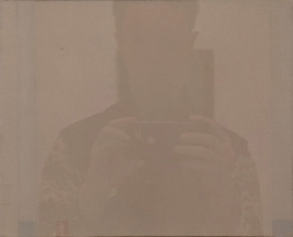
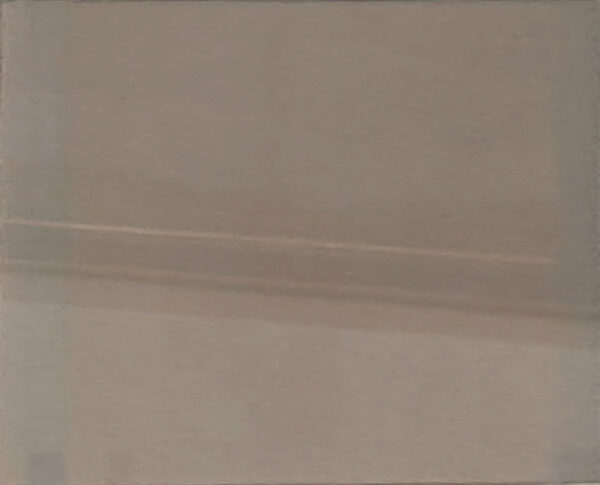
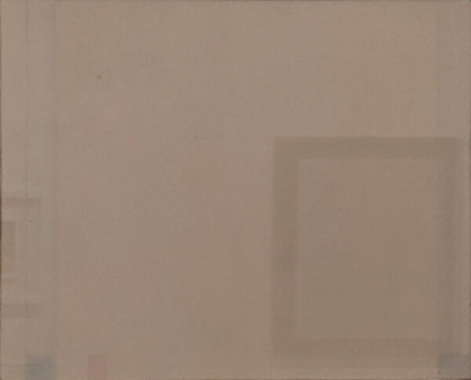
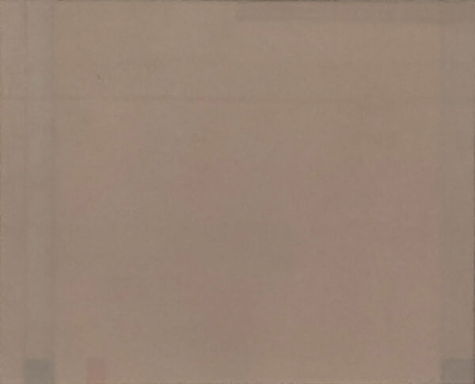
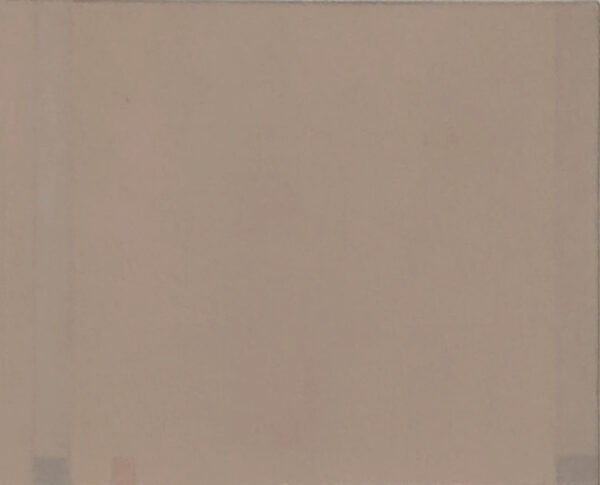

I lean forward to get a better view of the painting, but the couple behind me is in the way.

<figure></img></figure>

When I stand in front of the painting, my own obscuring figure fills the frame.

<figure></img></figure>

Perhaps the artist, who throughout his work played incessantly with reflections, would be tickled that these pictures are so bedeviled.

<figure></img></figure>

Or does the painting, in fact, have the upper hand as it absorbs the gallery into its world of just-barely-perceptible variations of taupe?

<figure></img></figure>

If I just bend my knees and lean to the side a little further, perhaps I can shunt the air vent on the wall behind me up and out of the picture.

<figure></img></figure>

Sitting at the end of the bench in the middle of the room, I can see the painting at last.     It's better in person, I promise.

