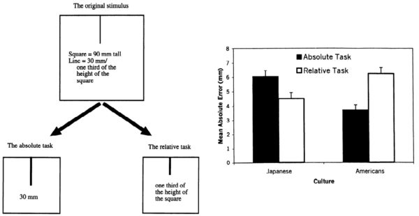

[teamLab]: http://www.team-lab.net/
[Pace Art + Technology]: http://www.pacegallery.com/
[Living Digital Space and Future Parks]: http://exhibition.team-lab.net/siliconvalley/
[linear perspective]: https://en.wikipedia.org/wiki/Perspective_(graphical)
[Ultra Subjective Space]: https://www.team-lab.net/concept/chou_shukan_kukan/
[parallel projection]: https://en.wikipedia.org/wiki/Parallel_projection
[The Tale of Genji]: https://en.wikipedia.org/wiki/The_Tale_of_Genji

[Toshiyuki Inoko interview]: http://ultrasubjectivespace.com/
[Filippo Brunelleschi]: https://en.wikipedia.org/wiki/Filippo_Brunelleschi#Discovery_of_linear_perspective
[Yatagarasu]: https://en.wikipedia.org/wiki/Three-legged_crow
[Itano Circus]: https://www.youtube.com/watch?v=BzXfVgYCxWI
[Riemannian sum]: https://en.wikipedia.org/wiki/Riemann_sum
[Schwarzschild embedding diagram]: https://en.wikipedia.org/wiki/Minkowski_diagram#/media/File:GPB_circling_earth.jpg

[Tversky & Hard]: http://www.tamu.edu/faculty/stevesmith/689/sketching%20&%20creativity/Tversky%20&%20Hard%202009.pdf
[Kubovy]: http://www.webexhibits.org/arrowintheeye/

[Crystal Universe]: http://exhibition.team-lab.net/siliconvalley/art/art01.html
[Flowers and People]: http://exhibition.team-lab.net/siliconvalley/art/art09.html
[Black Waves in Infinity]: http://exhibition.team-lab.net/siliconvalley/art/art02.html 

[rakuchu-rakugai-zu]: http://www.metmuseum.org/art/collection/search/53428
[tale-of-genji]: http://www.metmuseum.org/art/collection/search/39665

[Abby LaPier]: https://abbylapier.com/
[Camille Utterback]: http://camilleutterback.com/
[Sally Fama-Cochrane]: http://sallyfamacochrane.com/
[Yukio Lippit]: http://haa.fas.harvard.edu/people/yukio-lippit

[sources]: https://docs.google.com/document/d/1om4zfArwMVTKrA8iS_AbxxacKu0ptwX7BQOwhNGnT14/pub

The best visual spectacle in the Bay Area right now is the show of digital installation art by Japanese art group [teamLab][] at [Pace Art + Technology][] in Menlo Park. The show is a vast warren of dazzling sights: a [narrow path through a forest of glowing LEDs][Crystal Universe], a [cave full of projected flowers endlessly blooming and dying][Flowers and People], a [hazy world of dark waves stretching into infinity][Black Waves in Infinity]. The twenty artworks are beautiful, intricate, and masterfully executed, but they quickly blur together into a highbrow funhouse, a sophisticated trade show. The show is grounded in teamLab’s homegrown theory of spatial perception and motivated by the group’s ambitions for social harmony and the advancement of Japanese art. These ideas might have elevated the show, but they are underdeveloped and unconvincing. Nevertheless, they suggest exciting new directions for inquiry into the relationship between culture and perception.

The show is anchored by a theory of spatial perception which teamLab calls [Ultra Subjective Space][]. This theory is teamLab’s challenge to [linear perspective], the system of spatial representation developed during the Italian Renaissance. In linear perspective, objects which are farther away from the viewer appear smaller, while Ultra Subjective Space shares with [parallel projection][] the tendency for objects to climb vertically as they recede, without diminishing in size. Perspective originated as a geometric specification for representing space and shaped subsequent Western artistic output through its force as an idea. Against this, teamLab developed Ultra Subjective Space by looking backwards. Beginning with the assumption that Japanese painting must have been silently guided by a system of spatial representation analogous to linear perspective, the group set out to uncover this hidden set of laws by recreating traditional Japanese paintings using digital modeling and rendering.

teamLab is hardly the first group to think beyond linear perspective. Subverting linear perspective is by now a tradition almost as venerable as perspective itself. More than a hundred years ago, Cubism and other Modern movements broke the centuries-long hegemony of linear perspective over fine art in the West with paintings and manifestos exploring multiple vantage points. Yet today, perspective still dominates popular art through photography, film, animation, and illustration, and it maintains an exclusive claim on truth that other modes of spatial representation have been unable to match. For most Western viewers, perspectival spatial recognition is a reflexive habit, and familiarity blinds us to its pervasive presence, making it hard to adopt or even imagine alternatives.

Though the crusade against linear perspective is not new, teamLab’s motivation for pursuing it is unique, forged from a combined belief in the power of Ultra Subjective Space to foster social harmony and advance the international appreciation of Japan’s classical cultural heritage. Toshiyuki Inoko, the founder of teamLab, mused in a [2013 interview][Toshiyuki Inoko interview]: “What if a visual approach different from Western spatial recognition took root and became the norm? If all of mankind were looking at the world in that spatial manner [of Ultra Subjective Space], before long the boundaries between man and his environment would stop making sense, and we might create a new kind of society and culture.” The mission of the show, then, is to make Ultra Subjective Space intelligible, palatable, and even natural.

Sadly, I found the earnest texts accompanying the artworks in the Menlo Park exhibition to be utterly unconvincing, full of ambitious unsupported claims which didn’t match my experience of linear perspective or of teamLab’s artworks. teamLab says that in Ultra Subjective Space, there is, “no barrier between the viewer and the projection surface,” and that viewers can, “can pretend to enter and move around freely within the space of the painting...without priority over anybody else.” Although Ultra Subjective Space is presented as an analogue of linear perspective, it is never precisely defined, either in terms of teamLab’s computer models or by reference to classical Japanese writing on aesthetics. Because the mechanics of Ultra Subjective Space are never specified, it’s impossible to assess the truth of teamLab’s claims, except through experience. Likewise, the supposed utopian effects of Ultra Subjective Space are so broad as to be meaningless (What kind of new society and culture might Ultra Subjective Space create? How would it change the relationships between people and nature?) In the absence of compelling verbal arguments for Ultra Subjective Space, the task of persuasion is left to the artworks themselves.

_Flowers & Corpse Glitch Set of 12_, a lush animated narrative which unfolds simultaneously across twelve digital screens, demonstrates the three-dimensionality of Ultra Subjective Space. Modeled after paintings like the 17th century _rakuchū rakugai zu_ (_Scenes in and around the Capital_), and _Tale of Genji_, _Flowers & Corpse Glitch Set of 12_ is unmistakably Japanese in style, an exemplar of Ultra Subjective Space. As the camera orbits through the depicted scene, the landscape changes smoothly, reassuring the viewer that this space, though it appears flat, has volume and depth enough to accommodate movement and multiple points of view. The animated images in _Flowers & Corpse Glitch Set of 12_ play on repeat, and shortly into each loop, the surface of the image begins to flake away to reveal a skeletal wireframe underneath. Drawn in the style of an engineering blueprint or [physics diagram][Schwarzschild embedding diagram], this wireframe dramatizes the technological nature of the 3D digital model used to create the image. This wireframe is an abstracted representation of the world which is legible to Western viewers. It mediates between Japanese and Western forms of spatial recognition and lends the Japanese approach an aura of scientific credibility.

<figure>
</img>
<figcaption>The _rakuchū rakugai zu_, or _Scenes in and around the capital_ was a popular subject in 17th century Japanese art. This rendition, painted on a pair of six-panel folding screens (_Set of 12_...) recalls _Flowers & Corpse Glitch Set of 12_ in the birds-eye view, the use of parallel perspective, and the treatment of clouds (rendered with gold leaf). © [The Metropolitan Museum of Art][rakuchu-rakugai-zu].</figcaption>
</figure>

<figure>
</img>
<figcaption>Genji, the protagonist of _Flowers & Corpse Glitch Set of 12_, is drawn from the 11th century novel _[The Tale of Genji][]_. This set of painted screens depicting scenes from the _Tale of Genji_ are from the mid-16th / early-17th century. © [The Metropolitan Museum of Art][tale-of-genji].</figcaption>
</figure>

For me, _Flowers & Corpse Glitch Set of 12_ conveys the mechanics of Ultra Subjective Space without evoking its utopian effects. teamLab argue that images using Ultra Subjective Space bring the viewer into harmony with nature by dissolving the boundaries between experiential and depicted space. Yet I find that entering the space of _Flowers & Corpse Glitch Set of 12_ is a struggle. I am still in thrall to linear perspective, and imagining myself convincingly in a scene means seeing it in perspective. I can easily paste myself like a paper doll onto the surface of _Flowers & Corpse Glitch Set of 12_, but actually placing myself within the image requires an imaginative twist to warp isotropic space into linear perspective around my avatar. I find the image intelligible but inhospitable.

<figure>

<iframe class="youtube-video" width="100%" src="https://www.youtube.com/embed/hXLa4s3TnyY" frameborder="0" allowfullscreen></iframe>

<!-- .youtube-container -->
</figure>

Recent findings from cultural psychology offer a means of reconciling my experience of _Flowers & Corpse Glitch Set of 12_ with teamLab’s claims about Ultra Subjective Space. Psychologists Sean Duffy, Shinobu Kitayama, and Hazel Markus observe distinct “Eastern” and “Western” styles of visual perception and propose that they are anchored in different conceptions of the self. In the West, they write, “the normative imperative...is to become independent from others and to discover and express one’s own unique attributes,”[1](#culture-and-the-self) while in the East, “responsiveness to the concerns of social others, as well as the expectations of others, forms the basis for action.”[2](#culture-modes-of-seeing-55) Simply by living in a particular culture, people acquire skills, values, and behaviors which reinforce the culturally dominant mode of being. Duffy, Kitayama, and Markus argue that visual perception is one such culturally contingent skill.

Visual perception reflects the different conceptions of the self through complementary strategies of focused and dispersed visual attention. Duffy and Kitayama write that, “in the focused attention strategy, individual objects and their focal features receive the vast majority of the cognitive resources of attention,” while in the dispersed attention strategy, “objects surrounding the attended object, or features of the object’s context receive considerable attention, at the cost of focal information about the individual objects.”[3](#cultural-modes-of-seeing-57) Using controlled experiments like the framed line test, Kitayama et. al. have shown that Japanese subjects excel at tasks requiring dispersed attention, while American subjects perform better on tasks requiring focused attention.

<figure>
</img>
<figcaption>In the framed line test (FLT), subjects are shown a line inside a frame (above, left), and then asked to reproduce the line in frames of varying sizes in two different ways. Subjects are asked to produce a line of the same absolute length (the "absolute task"), or of the same length, relative to the size of the enclosing frame (the "relative task"). Duffy & Kitayama's results (total N = 111) show that Japanese subjects perform better on the relative task, while American subjects perform better on the absolute task. Diagrams from Duffy, Kitayama, et. al., "Perceiving an object and its context in different cultures."</figcaption>
</figure>

These strategies of visual attention could explain why it is hard for me to imagine myself in the depicted space of _Flowers & Corpse Glitch Set of 12_. Entering an image requires mentally reconstructing the depicted space based on the the visual features of the image. Despite teamLab’s claims to the contrary, Western viewers do imagine themselves within perspective images.[4](#spatial-perspective-taking) A 2006 study of facial recognition found that North American subjects were more sensitive to the intrinsic properties of facial features and Japanese subjects to overall facial configuration. Perhaps linear perspective feels natural to Western viewers because distance is encoded in size, an intrinsic property of objects which rewards focused attention, while in Ultra Subjective Space, distance is encoded in the overall configuration of objects, which demands dispersed attention.

Beyond this suggestive analogy between spatial and facial recognition, the construction of images in linear perspective and Ultra Subjective Space presupposes different conceptions of the self. Linear perspectives are calculated to reproduce the world faithfully from a single vantage point. This principle is dramatized in one of the earliest perspective images, a 15th century [painting of the Florentine Baptistry by Filippo Brunelleschi][Filippo Brunelleschi]. Brunelleschi had viewers place their heads into a hood which cut off peripheral vision so that the painting could only be seen through a single pinhole. From this early beginning, linear perspective has demanded an autonomous, individual viewer: an independent self. By contrast, parallel projection can be understood as a sort of [Riemannian sum][] of perspectival views from infinitely many vantage points. The practice of showing the same place simultaneously at many different points in time, as in _Flowers & Corpse Glitch Set of 12_, further expands the number of viewpoints in Ultra Subjective Space. Feeling at ease with such an image requires a self capable of integrating these many viewpoints. Perhaps _Flowers & Corpse Glitch Set of 12_ is hard for me to enter and experience fully both because it presumes an unfamiliar conception of the self and demands unaccustomed habits of visual attention.

The sad irony of _Flowers & Corpse Glitch Set of 12_ and of my own means of appreciating it is not lost on me. Although teamLab announces that Ultra Subjective Space will bring, “New Spatial Awareness through Digital Technology,” the legitimation of Ultra Subjective Space by science in _Flowers & Corpse Glitch Set of 12_ comes at the expense of the lush Japanese details of the image. The cultural psychology research reassures me; it helps me believe as well as understand the truth of teamLab’s earnest arguments. Yet how bittersweet, that my conversion should come from reading social science research papers, rather than from the experience of the artwork itself.

The interactive projection _Sketch Town_ allows me to enter and experience Ultra Subjective Space more fully by encouraging me to externalize the adoption of a new way of seeing. Participants in _Sketch Town_ are invited to color in the outlines of familiar objects - fire trucks, houses, airplanes, UFOs - and then scan the crayon drawings. With my drawing scanned, I turn eagerly to a projected landscape which fills one wall, waiting for my creations to appear. Each crayon drawing is by itself spatially neutral; each airplane or car or truck could equally have been cut out of a linear perspective or an Ultra Subjective Space. Yet it is natural for Western viewers to imagine their object as belonging to a linear perspective image. When the drawing appears in the Ultra Subjective Space of the projected landscape, the viewer is forced to reconcile the assumption of perspective with the reality of Ultra Subjective Space. _Sketch Town_ works because people are attached to their own creations, and rather than abandon their drawings in the unfamiliar territory of Ultra Subjective Space, viewers modify their visual expectations to accommodate it.

<figure>

<iframe class="youtube-video" width="100%" src="https://www.youtube.com/embed/ZVcWKBTVbvE" frameborder="0" allowfullscreen></iframe>

<!-- .youtube-container -->
</figure>

High on an adjacent wall, a small perspective projection of the _Sketch Town_ landscape highlights the strengths of the Ultra Subjective Space and helps make viewers conscious of their spatial habituation. This perspective projection draws on another familiar Western precedent - not the Renaissance painting, but the first-person shooter video game. Unlike a first-person shooter, however, there’s no way to control the vantage point. As the camera drifts through the scene, a glance at the Ultra Subjective Space representation underscores the limitations of this first-person view from which only a tiny fraction of the landscape is visible at a time, subject to the caprices of the camera’s motion. In the Ultra Subjective Space view, by contrast, it is possible to grasp relationships and to see that each entity has a well-defined role to play: UFOs move cars around, fire trucks extinguish burning buildings, and airplanes fight monsters. The juxtaposition of spatial modes in _Sketch Town_ is an effective reminder that spatial recognition is acquired, and that there are alternatives.

All of this careful work to explain and evoke Ultra Subjective Space comes together in my favorite piece, an immersive video installation called _Crows are Chased and the Chasing Crows are Destined to be Chased as Well, Division in Perspective – Light in Dark_. More relaxed in its approach to spatial representation than either _Sketch Town_ or _Flowers & Corpse Glitch Set of 12_, this piece honors Japan’s cultural heritage through references to the mythical crow [Yatagarasu], and in its re-interpretation of the [Itano Circus][]. This piece is less didactic, more lighthearted and eclectic, and I am able to appreciate it viscerally. Each time I stand in the middle of the dark room to experience the film, the joyful careening of the watercolor crows in the iridescent darkness impels me to move my body, to dance.

<figure>

<iframe class="youtube-video" width="100%" src="https://www.youtube.com/embed/tjfDZP9YOcs" frameborder="0" allowfullscreen></iframe>

<!-- .youtube-container -->
</figure>

_Crows are Chased_ evokes this powerful response because of the way that it uses projection surfaces to convey a sense of space. One long wall serves as the main projection surface. This wall is partially obscured by freestanding walls on either side of the room which show fragments of the scene on the long wall behind, progressively magnified. By interleaving the projections with the inhabitable space of the gallery using these freestanding walls, teamLab gives the film a powerful three-dimensional quality. For a viewer standing at the back of the gallery, the rows of freestanding walls suggest a vanishing point at the center of the long wall, and the exaggerated size of the closer images creates a forced perspective which amplify the impression of depth. The camerawork is masterful as well; the camera swings and swoops as if it is yet another crow, chased and chasing. As flowers and crows spin from one panel to the next, they shrink in lurches and then grow large again, so that the forced perspective also exaggerates the whirling movement in the film.  The floor, polished to a glossy obsidian, reflects these swooping animated figures in hazy washes of color which fill my peripheral vision. The result is neither linear perspective, nor Ultra Subjective Space, but some synthesis of the two.

I leave the gallery with a headache from the bright lights and strange odors and emerge blinking into a sunlit world of linear perspective. teamLab’s artworks haven’t fundamentally changed the way that I see the world. Truth aside, Ultra Subjective Space is a slogan with which teamLab hopes to rally a revolution against perspective. Yet, if it is to succeed, Ultra Subjective Space must be backed by more than naive revolutionary bravado, and it must be motivated by more than the vague promise of “a new kind of society.” For all its limitations and inherent biases, linear perspective is useful in the West - it is a cultural competency demanded and reinforced by mass culture. teamLab fails to provide a compelling reason to forego this cultural competency and adopt a new way of seeing the world. 

In any case, the gallery may not be the best forum for teamLab’s utopian mission. As long as teamLab shows their work only in Menlo Park or New York City, charging admission of $20 a head, its reach will be limited both by geography and by affordability. Inoko has commented on the Ultra Subjective qualities of platform video games, saying that, “a life lived within Japanese spatial design may have been at root in the creation [by Japanese designers] of Mario and its distinctive style.” Video games cannot offer the immersive experience of installation art - but aside from _Crows are Chased_, teamLab’s large-scale installations in Menlo Park are mere glitz-and-glitter entertainments. There are plenty of platform games, but the rich, beautiful images in _Flowers & Corpse Glitch Set of 12_ and _Crows are Chased_ suggest that teamLab has the unique artistic and technical abilities to create video games which celebrate Japan’s classical artistic heritage. Finally, video games using motion sensing and emerging VR technologies could bring powerful experiences of Ultra Subjective Space far beyond the gallery. teamLab’s show in Menlo Park leaves much to be desired, but their future is full of promise.

-----------

Thanks to Abigail Kelly, [Abby LaPier][], Michael Webb, [Sally Fama-Cochrane][] and Professors [Camille Utterback][] and [Yukio Lippit][] for fruitful conversations and suggestions.

For further reading, see _Cultural Modes of Seeing Through Cultural Modes of Being_ (Duffy & Kitayama), _[The Psychology of Perspective and Renaissance Art][Kubovy]_ (Kubovy), and teamLab’s _[Dialogue between Toshiyuki Inoko and Yuji Yamashita][Toshiyuki Inoko interview]_ (Erimi), or see my [full list of sources][sources].

<a name="culture-and-the-self">1</a>: Markus, Hazel and Shinobu Kitayama. “Culture and the Self: Implications for Cognition, Emotion, and Motivation.”

<a name="cultural-modes-of-seeing-55">2</a>: Duffy, Sean & Shinobu Kitayama. "Cultural Modes of Seeing through Cultural Modes of Being" in _Social Psychology of Visual Perception_. 55.

<a name="cultural-modes-of-seeing-57">3</a>: Ibid. 57.

<a name="spatial-perspective-taking">4</a>: Tversky, Barbara and Bridgette Martin Hard. "Embodied and disembodied cognition: Spatial perspective-taking."

