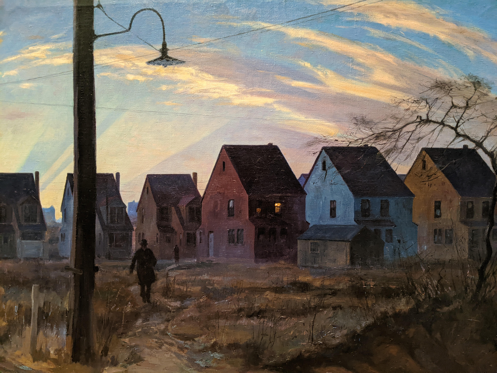
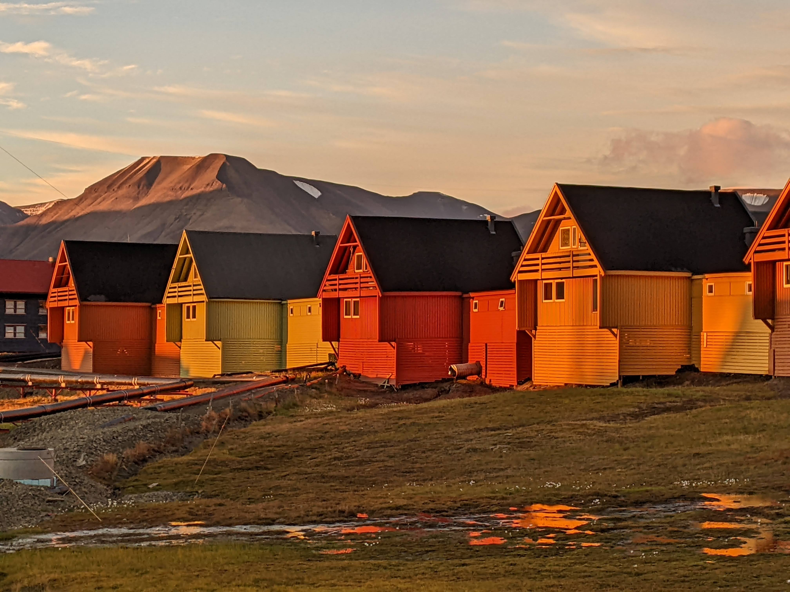

<figure>
</img>
</figure>

The year is 1933. Depression. If the settlement of Sandy Hook is anything like the rest of the country, no fewer than four or five of the ten houses are in default of their mortgage. 

A commuter hastens along the dirt path that cuts across the vacant lots between the huddled houses and the train platform. Two years later, the railroad company will go bankrupt. People will choose to take their newly-bought automobiles on the newly-built highway instead. The train station will be closed, then demolished, the tracks taken up and melted down. No one will remember that the train whistle could once be heard here, on this street, as the sun rose each morning into the Agnes Pelton sky.

Seventy-nine years later, the same town. Perhaps one of these same houses. A son shoots his mother dead in her own bed with her own rifle before driving to the local elementary school and killing twenty-six people: six adults and twenty six- and seven-year-olds. He ends by turning his mother’s gun on himself.

Twenty miles south on that same Friday morning, my mother has already left the house. She leaves around 6:30 as she does every weekday morning, speeding off in her hatchback to catch the commuter train into the city. The black messenger bag she carries is heavy, but I do not think it holds her gun, although she once had her shooting license suspended when she left her purse and the pistol inside it atop the tank of a toilet in a highway rest stop.

Five months after the shooting, the Sandy Hook city council will vote to demolish the elementary school. There is nothing wrong with the building except that it is contaminated by memory. The school will be rebuilt with bulletproof glass: fortified. The house in which the shooter grew up will eventually be donated to the town and demolished as well. Its lot remains empty to this day.

The deadliest mass shooting ever perpetrated by a single person occurred a year and a half before the shooting at Sandy Hook, at a Labour Party youth summer camp on the island of Utøya, in Norway. Viljar Hanssen, an eighteen-year-old boy from the Arctic archipelago of Svalbard, was shot five times while shielding his younger brother. He was shot in his thigh, his hand, his forearm, his shoulder, and his head. He lost all vision in one eye, and has fragments of the bullet which hit his head permanently embedded in his brain. But he survived. 

At the shooter’s trial, Hanssen testifies: “I only feel safe in a moving car.” The archipelago that is his home has only twenty-five miles of road. Anyone traveling outside Longyearbyen, the archipelago’s only settlement, must carry a gun for protection against polar bears. In 2011, a seventeen-year-old boy on a camping trip twenty-five miles from Longyearbyen was killed by a polar bear.

Back in Longyearbyen, Hanssen runs for the city council almost as soon as he is released from the hospital. He joins his mother, who had been elected mayor just two months before the shooting. He is the youngest person ever elected to the city council. 

Hanssen vows to get more houses built. Perhaps the houses will be red and yellow and orange; they will glow in the endless golden hour of Svalbard’s summer midnights and gleam in the puddles of snowmelt that pool at the base of Svalbard’s rocky peaks. Does it count as sunset if the sun never sets? Loneliness, says Hanssen, is one of the great challenges of our time.

<figure>
</img>
</figure>

[Back to the book](/projects/photo-pairs/book)
